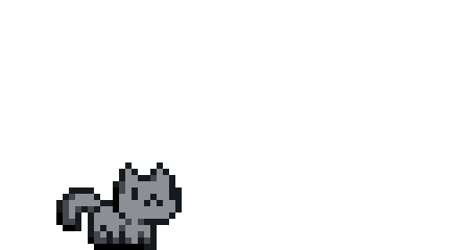
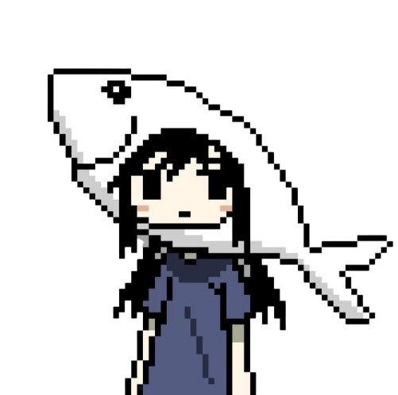

<!-- Typing Title -->
<div align="center">

 
  ### ⋆𐙚₊˚⊹♡ > Chaotic introvert who finds bugs for fun and calls it a career 🐛✨ ♡⊹˚₊𐙚⋆ 
  
    
  #### software tester • anime lover • cat person  
   
</div>

<!-- About Me -->

<div align="center">


<table align="left">
<tr>
<td width="55%">

###  `About Me` ᓚᘏᗢ

```yaml
name:        Sakshi Vaity
role:        Software Tester 🔎
company:     TheAdroit, Navi Mumbai
experience:  9 months (Intern → Full-time) 🚀
education:   BE Computer Engineering — Mumbai University 2025
certified:   ISTQB® CTFL v4.0 🏅
bugs found:  150-200+ and counting 🐛
hobbies:     anime • gaming • cats
vibes:       soft but make it chaotic ✨
```

</td>

</div>


<table> <tr> <td width="50%" valign="middle">  # ⋆˚✿˖° sakshi vaity °˖✿˚⋆ ### software tester • anime lover • cat person 🌸 cat lover 🐾 </td> <td width="50%" align="right">  </td> </tr> </table>

---

<table>
<tr>

<td width="50%">

## 🌸 about me

- 🎀 computer engineering graduate
- 🐈 cat obsessed
- 💻 software testing
- 🌌 anime + galaxy aesthetic
- ☕ coffee addict


</td>

<td width="50%">

## 💫 tech stack


</td>

</tr>
</table>
```
<!-- HEADER BANNER -->
<div align="center">

```
 ／ﾌﾌ　　　 ム｀ヽ
/ ノ)　　　∧∧ﾉ ヽ
/ |　(•ω• )ノ⌒
/ ノＶ￣Ｙ∨     bug? what bug? ✨
```

</div>

<!-- Animated Typing Title -->
<div align="center">
  
</div>

<br/>

<!-- Pastel Divider -->
<p align="center">
  
</p>

---

<!-- About Me Card -->
<table align="center">
<tr>
<td width="55%">

### 🌸 `whoami`

```yaml
name:       [your name here]
role:       Software Tester 🧪
status:     Finding bugs since day one 🐛
mood:       Soft + chaotic energy ✨

currently:
  - breaking things (professionally)
  - watching anime at 2am 🌙
  - being owned by my cat 🐈
  - losing to final boss 🎮

aesthetic:  baby blue • baby pink
            baby green • white • black 🎀
```

</td>
<td width="45%" align="center">

```
    ╭──────────────╮
    │  (=^･ω･^=)  │
    │   my cat     │
    │   judging    │
    │   my code    │
    ╰──────────────╯
         |
    ╭──────────────╮
    │ test passed! │
    │  (she lied)  │
    ╰──────────────╯
```

</td>
</tr>
</table>

---

<!-- Skills Section -->
## 🧪 my testing toolkit

<div align="center">


</div>

---

<!-- Testing Philosophy -->
## 🌷 my testing philosophy

<div align="center">

```
╭─────────────────────────────────────────────────────╮
│                                                     │
│   "if it can break, i will find a way to break it" │
│                                                     │
│     🐾 step 1 — read the requirements              │
│     🐾 step 2 — break the requirements             │
│     🐾 step 3 — report 47 bugs before lunch        │
│     🐾 step 4 — eat snacks & repeat                │
│                                                     │
│              ~ art of QA, probably ~                │
╰─────────────────────────────────────────────────────╯
```

</div>

---

<!-- Fun Facts -->
## 🎀 lore about me

<div align="center">

| 🐱 cat lore | 🎮 gamer lore | 🌸 anime lore |
|:---:|:---:|:---:|
| my cat walks on my keyboard and files better bug reports than some devs | i pause games to test the edge cases | i cry every season finale without fail |
| she reviews all my test cases | controller grip = stress reliever | my watchlist is longer than my bug log |
| named my first test suite after her | yes i have a gaming chair | isekai protagonist energy |

</div>

---

<!-- GitHub Stats -->
## 📊 my stats (the devs wish were this clean)

<div align="center">
  
  
</div>

<br/>

<div align="center">
  
</div>

---

<!-- Anime / Currently Watching -->
## 📺 current obsessions

```
🌸 currently watching  →  [your current anime]
🎮 currently playing   →  [your current game]
📚 currently reading   →  [manga / light novel]
😻 current cat mood    →  judging me from the top shelf
```

---

<!-- Snake Game / Activity Graph -->
## 🐍 watch the snake eat my contributions

<div align="center">
  
</div>

---

<!-- Footer -->
<div align="center">

```
(=^‥^=)  thanks for visiting my little corner of the internet  (=^‥^=)
```

<br/>

[](https://linkedin.com/in/YOUR_PROFILE)
[](https://twitter.com/YOUR_HANDLE)
[](mailto:YOUR_EMAIL)

<br/>


<br/>

*made with 🌸 cat hair ☕ matcha and 🧪 infinite test cases*

</div>

<!-- FOOTER WAVE -->
<p align="center">
  
</p>


<!-- HEADER WAVE -->


<!-- Animated Typing Title -->
<div align="center">
  
</div>

<br/>

---

<!-- About Me -->
<table align="center">
<tr>
<td width="55%">

### 🌸 `whoami`

```yaml
name:       sakshivaity
role:       Software Tester 🧪
status:     Finding bugs since day one 🐛
mood:       Soft + chaotic energy ✨

currently:
  - breaking things (professionally)
  - watching anime at 2am 🌙
  - being owned by my cat 🐈
  - losing to final boss 🎮

aesthetic:  baby blue • baby pink
            baby green • white • black 🎀
```

</td>
<td width="45%" align="center">

```
    ╭──────────────╮
    │  (=^･ω･^=)  │
    │   my cat     │
    │   judging    │
    │   my code    │
    ╰──────────────╯
         |
    ╭──────────────╮
    │ test passed! │
    │  (she lied)  │
    ╰──────────────╯
```

</td>
</tr>
</table>

---

<!-- Testing Toolkit -->
## 🧪 my testing toolkit

<div align="center">


</div>

---

<!-- Testing Philosophy -->
## 🌷 my testing philosophy

<div align="center">

```
╭─────────────────────────────────────────────────────╮
│                                                     │
│  "if it can break, i will find a way to break it"  │
│                                                     │
│     🐾 step 1 — read the requirements              │
│     🐾 step 2 — break the requirements             │
│     🐾 step 3 — report 47 bugs before lunch        │
│     🐾 step 4 — eat snacks & repeat                │
│                                                     │
│              ~ art of QA, probably ~                │
╰─────────────────────────────────────────────────────╯
```

</div>

---

<!-- Cat Section -->
## 🐱 say hi to my cat!

<div align="center">
  
  <br/>
  <sub><i>she judges my test cases but stays anyway</i> 🐾</sub>
  <br/><br/>

[](https://github.com/sakshivaity/sakshivaity)

</div>

---

<!-- Fun Facts Lore Table -->
## 🎀 lore about me

<div align="center">

| 🐱 cat lore | 🎮 gamer lore | 🌸 anime lore |
|:---:|:---:|:---:|
| my cat walks on my keyboard and files better bug reports than some devs | i pause games to test the edge cases | i cry every season finale without fail |
| she reviews all my test cases | controller grip = stress reliever | my watchlist is longer than my bug log |
| named my first test suite after her | yes i have a gaming chair | isekai protagonist energy |

</div>

---

<!-- Cat Diary -->
## 📔 diary — by my cat

<div align="center">

```
Day 247 of living with a software tester.

she woke up at 9am. opened 14 tabs. closed 13.
typed very fast for 3 minutes. said "what the—"
i walked across the keyboard. she blamed me
for a new bug. i am not sorry. it was funnier.

she fed me at 6pm (late). i gave her one star.
will not be recommending to other cats.

        — chairman meow 🐾
```

</div>

---

<!-- Bug Hall of Fame -->
## 🐛 bug hall of fame

<div align="center">

| 🏆 rank | bug discovered | severity | my reaction |
|:---:|:---|:---:|:---:|
| 🥇 #1 | button that deleted everything when you pressed "save" | 🔴 critical | silent victory dance |
| 🥈 #2 | date picker that only worked on tuesdays | 🟠 high | genuine confusion |
| 🥉 #3 | login that succeeded even with wrong password | 🔴 critical | immediate screenshot |
| 🎀 #4 | error message that said "success" | 🟡 medium | sent to the group chat |
| 🌸 #5 | dark mode that turned everything invisible | 🟠 high | aesthetic actually |

</div>

---

<!-- Currently Obsessed -->
## 📺 current obsessions

```
🌸 currently watching  →  [your current anime]
🎮 currently playing   →  [your current game]
📚 currently reading   →  [manga / light novel]
😻 current cat mood    →  judging me from the top shelf
```

---

<!-- Anime Tier List -->
## 🌸 anime tier list

<div align="center">

| tier | anime |
|:---:|:---|
| ✨ S — life changing | *your faves here* |
| 🌸 A — would rewatch | *your faves here* |
| 💙 B — solid watch | *your faves here* |
| 🤍 C — it was okay | *your faves here* |
| 🐛 dropped | *"i had my reasons"* |

</div>

---

<!-- GitHub Stats -->
## 📊 my stats (the devs wish were this clean)

<div align="center">
  
  
</div>

<br/>

<div align="center">
  
</div>

---

<!-- Snake Animation -->
## 🐍 watch the snake eat my contributions

<div align="center">
  <picture>
    <source media="(prefers-color-scheme: dark)"
      srcset="https://raw.githubusercontent.com/sakshivaity/sakshivaity/output/github-contribution-grid-snake-dark.svg" />
    <source media="(prefers-color-scheme: light)"
      srcset="https://raw.githubusercontent.com/sakshivaity/sakshivaity/output/github-contribution-grid-snake.svg" />
    
  </picture>
</div>

---

<!-- Footer -->
<div align="center">

```
(=^‥^=)  thanks for visiting my little corner of the internet  (=^‥^=)
```

<br/>

[](https://linkedin.com/in/sakshivaity)
[](mailto:your@email.com)

<br/>


<br/>

*made with 🌸 cat hair ☕ matcha and 🧪 infinite test cases*

</div>

<!-- FOOTER WAVE -->


<!-- HEADER -->
<div align="center">
  
</div>

<!-- Typing Title -->
<div align="center">
  
</div>

<br/>

---

<!-- About Me -->
<table align="center">
<tr>
<td width="58%">

### 🌸 `whoami`

```yaml
name:       sakshivaity
role:       Software Tester 🧪
status:     Finding bugs since day one 🐛
mood:       soft + chaotic energy ✨

currently:
  - breaking things (professionally) 💻
  - watching anime at 2am 🌙
  - being owned by my cat 🐈
  - losing to the final boss 🎮

aesthetic:  baby blue • baby pink
            baby green • white • black 🎀
```

</td>
<td width="42%" align="center">


<br/>
<sub><i>me & my supervisor 🐾</i></sub>

</td>
</tr>
</table>

---

<!-- Toolkit -->
## 🧪 my testing toolkit

<div align="center">


</div>

---

<!-- Testing Philosophy -->
## 🌷 my testing philosophy

<div align="center">


```
╭─────────────────────────────────────────────────────╮
│                                                     │
│  "if it can break, i will find a way to break it"  │
│                                                     │
│     🐾 step 1 — read the requirements              │
│     🐾 step 2 — break the requirements             │
│     🐾 step 3 — report 47 bugs before lunch        │
│     🐾 step 4 — eat snacks & repeat                │
│                                                     │
│              ~ art of QA, probably ~                │
╰─────────────────────────────────────────────────────╯
```

</div>

---

<!-- My Cat -->
## 🐱 meet my senior developer

<div align="center">


&nbsp;&nbsp;&nbsp;

&nbsp;&nbsp;&nbsp;


<br/><br/>

| mood | meaning |
|:---:|:---|
|  | reviewing my test cases. not impressed. |
|  | took my chair again. i am the one testing on the floor. |
|  | i passed a test case. she is cautiously pleased. |

</div>

---

<!-- Lore Table -->
## 🎀 lore about me

<div align="center">

| 🐱 cat lore | 🎮 gamer lore | 🌸 anime lore |
|:---:|:---:|:---:|
| my cat walks on my keyboard and files better bug reports than some devs | i pause games to test the edge cases | i cry every season finale without fail |
| she reviews all my test cases | controller grip = stress reliever | my watchlist is longer than my bug log |
| named my first test suite after her | yes i have a gaming chair | isekai protagonist energy |

</div>

---

<!-- Cat Diary -->
## 📔 diary — by my cat

<div align="center">


```
Day 247 of living with a software tester.

she woke up at 9am. opened 14 tabs. closed 13.
typed very fast for 3 minutes. said "what the—"
i walked across the keyboard. she blamed me
for a new bug. i am not sorry. it was funnier.

she fed me at 6pm (late). i gave her one star.
will not be recommending to other cats.

        — chairman meow 🐾
```

</div>

---

<!-- Bug Hall of Fame -->
## 🐛 bug hall of fame

<div align="center">


| 🏆 rank | bug discovered | severity | my reaction |
|:---:|:---|:---:|:---:|
| 🥇 #1 | button that deleted everything when you pressed "save" | 🔴 critical | silent victory dance |
| 🥈 #2 | date picker that only worked on tuesdays | 🟠 high | genuine confusion |
| 🥉 #3 | login that succeeded even with wrong password | 🔴 critical | immediate screenshot |
| 🎀 #4 | error message that said "success" | 🟡 medium | sent to the group chat |
| 🌸 #5 | dark mode that turned everything invisible | 🟠 high | aesthetic actually |

</div>

---

<!-- Currently -->
## 📺 current obsessions

<div align="center">


</div>

```
🌸 currently watching  →  [your current anime]
🎮 currently playing   →  [your current game]
📚 currently reading   →  [manga / light novel]
😻 current cat mood    →  judging me from the top shelf
```

---

<!-- Anime Tier List -->
## 🌸 anime tier list

<div align="center">

| tier | anime |
|:---:|:---|
| ✨ S — life changing | *your faves here* |
| 🌸 A — would rewatch | *your faves here* |
| 💙 B — solid watch | *your faves here* |
| 🤍 C — it was okay | *your faves here* |
| 🐛 dropped | *"i had my reasons"* |

</div>

---

<!-- GitHub Stats -->
## 📊 my stats (the devs wish were this clean)

<div align="center">
  
  
</div>

<br/>

<div align="center">
  
</div>

---

<!-- Snake -->
## 🐍 watch the snake eat my contributions

<div align="center">
  <picture>
    <source media="(prefers-color-scheme: dark)"
      srcset="https://raw.githubusercontent.com/sakshivaity/sakshivaity/output/github-contribution-grid-snake-dark.svg" />
    <source media="(prefers-color-scheme: light)"
      srcset="https://raw.githubusercontent.com/sakshivaity/sakshivaity/output/github-contribution-grid-snake.svg" />
    
  </picture>
</div>

---

<!-- Footer -->
<div align="center">


&nbsp;

&nbsp;


<br/>

```
(=^‥^=)  thanks for visiting my little corner of the internet  (=^‥^=)
```

<br/>

[](https://linkedin.com/in/sakshivaity)
[](mailto:your@email.com)

<br/>


<br/>

*made with 🌸 cat hair ☕ matcha and 🧪 infinite test cases*

<br/>


</div>
